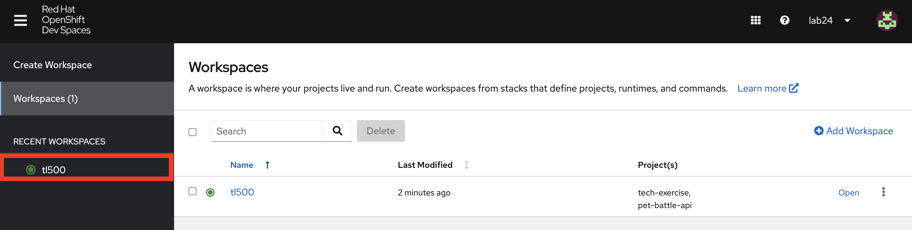
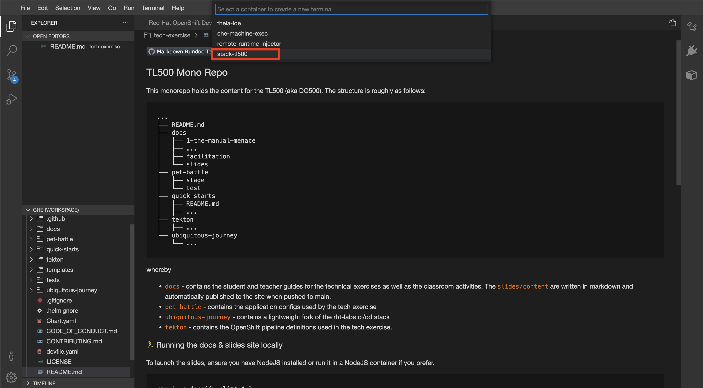
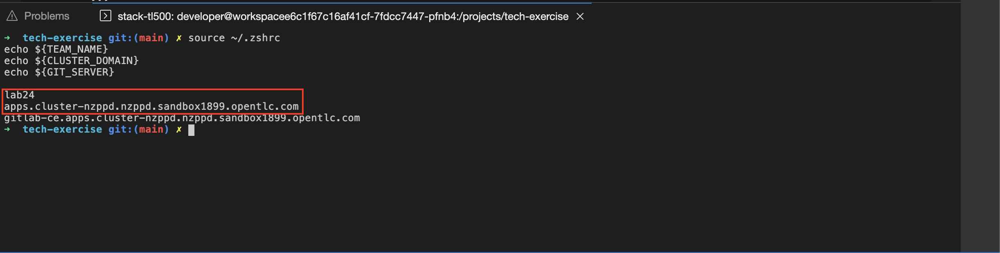
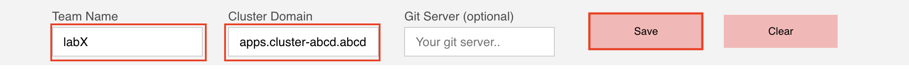

## 🐌 The Basics - CRW, OCP & Helm
## DevSpaces setup

1. Login to your DevSpaces Editor here - [https://red.ht/kcdmunich-devspaces](https://red.ht/kcdmunich-devspaces). Use the `FREE IPA` login and use the user credentials provided by the instructor. Click `tl500` from the left menu. It will open a new browser tab to take you your IDE.

    

    

2. In your IDE (it may take some time to open ... ⏰☕️), open a new terminal by hitting `Terminal > Open Terminal in Specific Container > stack-tl500` from the menu.

    

3. From the options, select `stack-tl500`, and then select the first option `tech-exercise` as the working directory.

    

4. Notice the nifty default shell in the stack-tl500 container is `zsh` which rhymes with swish. It also has neat shortcuts and plugins - plus all the cool kids are using it 😎! We will be setting our environment variables in both `~/.zshrc` and `~/.bashrc` in case you want to switch to `bash`.

5. Verify the variables you have set:

    ```zsh#test
    source ~/.zshrc
    echo ${TEAM_NAME}
    echo ${CLUSTER_DOMAIN}
    echo ${GIT_SERVER}
    ```

6. Copy your TEAM_NAME (`labX`) and CLUSTER_DOMAIN (something like `apps.cluster-abcd.abcd.sandbox1324.opentlc.com`) to the top of this page, and hit `Save`.

    

    

6. Check if you can connect to OpenShift. Run the command below by replacing `<USERNAME>` and `<PASSWORD>` with the ones provided. You might have to say yes to accept `The server uses a certificate signed by an unknown authority.` message

    <p class="tip">
    ⛷️ <b>TIP</b> ⛷️ - Before you hit enter, make sure you change the username and password to match your team's login details. If your password includes special characters, put it in single quotes. ie: <strong>'A8y?Rpm!9+A3B/KG'</strong>
    </p>

    ```bash
    oc login --server=https://api.${CLUSTER_DOMAIN##apps.}:6443 -u <USERNAME> -p <PASSWORD>
    ```

7. Check your user permissions in OpenShift by creating your team's `ci-cd` project. 

    ```bash#test
    oc new-project ${TEAM_NAME}-ci-cd
    ```

    

🪄🪄 Now, let's continue with even more exciting tools... !🪄🪄
