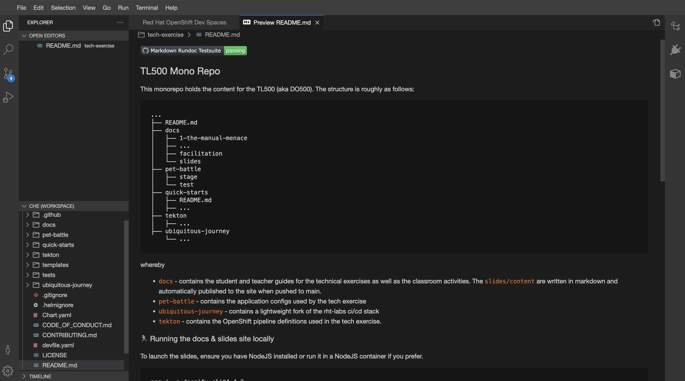
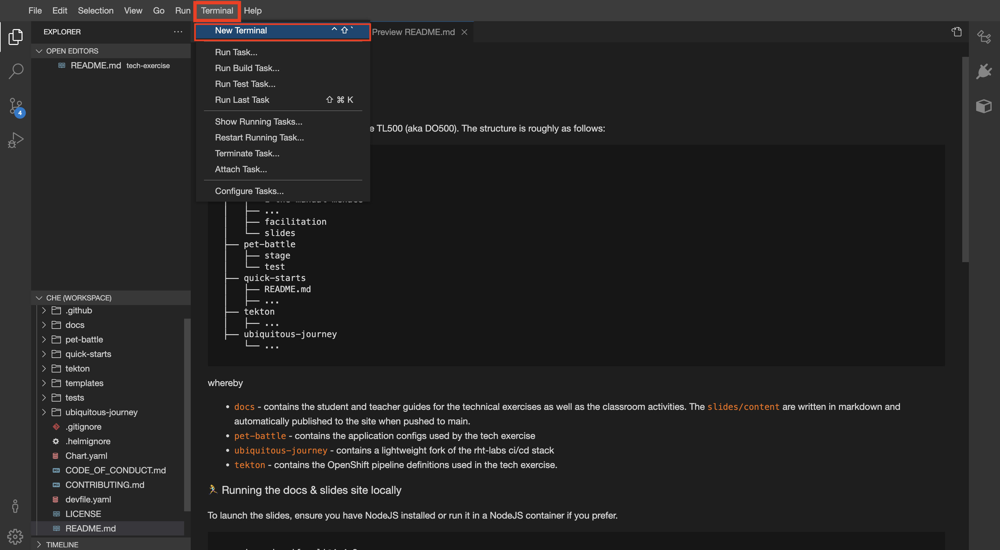

## 🐌 The Basics - CRW, OCP & Helm
## CodeReady Workspaces setup

1. Login to your CodeReadyWorkspace (CRW) Editor here - [https://devspaces.<CLUSTER_DOMAIN>](https://devspaces.<CLUSTER_DOMAIN>). Use the `FREE IPA` login and use the user credentials provided by the instructor

    

2. In your IDE (it may take some time to open ... ⏰☕️), open a new terminal by hitting `Terminal > Open Terminal in Specific Container > stack-tl500` from the menu.

    

3. Notice the nifty default shell in the stack-tl500 container is `zsh` which rhymes with swish. It also has neat shortcuts and plugins - plus all the cool kids are using it 😎! We will be setting our environment variables in both `~/.zshrc` and `~/.bashrc` in case you want to switch to `bash`.

7. Verify the variables you have set:

    ```zsh#test
    source ~/.zshrc
    echo ${TEAM_NAME}
    echo ${CLUSTER_DOMAIN}
    echo ${GIT_SERVER}
    ```

8. Check if you can connect to OpenShift. Run the command below by replacing `<USERNAME>` and `<PASSWORD>` with the ones provided. You might have to say yes to accept `The server uses a certificate signed by an unknown authority.` message

    <p class="tip">
    ⛷️ <b>TIP</b> ⛷️ - Before you hit enter, make sure you change the username and password to match your team's login details. If your password includes special characters, put it in single quotes. ie: <strong>'A8y?Rpm!9+A3B/KG'</strong>
    </p>

    ```bash
    oc login --server=https://api.${CLUSTER_DOMAIN##apps.}:6443 -u <USERNAME> -p <PASSWORD>
    ```

9. Check your user permissions in OpenShift by creating your team's `ci-cd` project. 

    ```bash#test
    oc new-project ${TEAM_NAME}-ci-cd
    ```

    

    <p class="warn">
        ⛷️ <b>NOTE</b> ⛷️ - If you are working as a team and are using the same TEAM_NAME, you may receive a message saying this project already exists. One of your team mates would have already created this project. It's all good!
    </p>

🪄🪄 Now, let's continue with even more exciting tools... !🪄🪄
