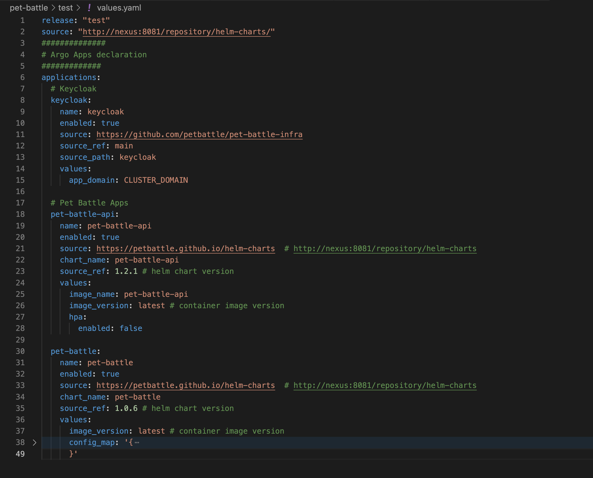

## Deploy App of Apps

We need a way to bundle up all of our applications and deploy them into each environment. Each PetBattle application has its own Git repository and Helm chart, making it easier to code and deploy independently from other apps.

A developer can get the same experience and end result installing an application chart using `helm install` as our fully automated pipeline. This is important from a useability perspective. Argo CD has great support for all sorts of packaging formats that suit Kubernetes deployments, `Kustomize`, `Helm`, as well as just raw YAML files. Because Helm is a template language, we can mutate the Helm chart templates and their generated Kubernetes objects with various values allowing us to configure them with configuration per environment.

We deploy each of our applications using an Argo CD `application` definition. We use one Argo CD `application` definition for every environment in which we wish to deploy the application. We make use of Argo CD `app of apps pattern` to bundle all of these all up; some might call this an application suite or a system! In PetBattle we generate the app-of-apps definitions using a Helm chart.

### Deploying Pet Battle

> In this exercise we'll deploy PetBattle and a supporting piece of tech it uses (Keycloak) using the same pattern. We'll deploy PetBattle to two environments - `test` and `stage` by configuring the values files in `pet-battle/stage/values.yaml` && `pet-battle/test/values.yaml`

1. In your IDE - open `tech-exercises/values.yaml` file at the root of this project and **swap** `enabled: false` to `enabled: true` as shown below for each of the app-of-pb definitions:

    <div class="highlight" style="background: #f7f7f7">
    <pre><code class="language-yaml">
      # Test app of app
      - name: test-app-of-pb
        enabled: true
        source_path: "."
        helm_values:
          - pet-battle/test/values.yaml
      # Staging App of Apps
      - name: staging-app-of-pb
        enabled: true
        source_path: "."
        helm_values:
          - pet-battle/stage/values.yaml
    </code></pre></div>

2. Our app is made up of N apps. We define the list of apps we want to deploy in the `applications` property in our `pet-battle/test/values.yaml`. This has been prefilled for you but you can see our Pet Battle is made up of three services defined in this manifest



3. Let's get this deployed of course - it's not real unless its in git!

    ```bash#test
    cd /projects/tech-exercise
    git add .
    git commit -m  "🐰 ADD - app-of-apps and pet battle to test env 🐰"
    git push 
    ```

4. With the values enabled, and the first application listed in the test environment - let's tell ArgoCD to start picking up changes to these environments. To do this, simply update the helm chart we installed at the beginning of the first exercise:

    ```bash#test
    cd /projects/tech-exercise
    helm upgrade --install uj --namespace ${TEAM_NAME}-ci-cd .
    ```

5. In ArgoCD at this point we should see things start to get a bit more busy:


5. You should see the two Pet Battle apps for `test` and `stage` deployed in ArgoCD and if you drill into one eg `test-app-of-pb` you'll see each of the three components of PetBattle:


6. Finally - let's see if the whole thing in working. Some pods - like keycloak - may take a little while to become ready. Go to `OpenShift -> Developer View -> Topology` and select your `<TEAM_NAME>-test` project.
    </br>
    🪄 🪄 You should be able to see the Pet Battle Applications running. 🪄 🪄

    

    </br>
    😻😻 Select the Pet Battle URL link highlighted above and you should see ... 😻😻

    
